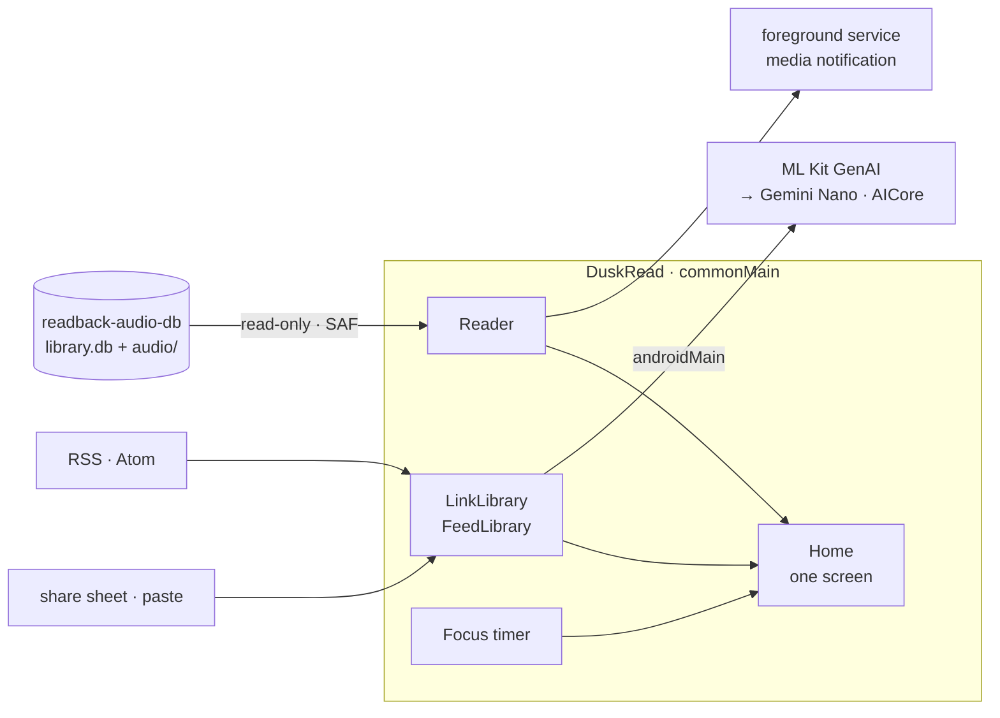

<p align="center">
  
</p>

<h1 align="center">DuskRead</h1>

<p align="center">
  <strong>Save what you want to read, follow the blogs worth following, and hear it all read back.</strong><br>
  Summarised on your phone by Gemini Nano — no server, no API key, no round trip.<br>
  One Kotlin codebase; Android is the one that's finished.
</p>

<p align="center">
  
  
  
  
</p>

<p align="center">
  
  
  
  
  
</p>

<p align="center">
  <a href="#getting-started">Getting started</a> ·
  <a href="#saved-links-and-feeds">Links &amp; feeds</a> ·
  <a href="#readback">Readback</a> ·
  <a href="#on-device-summaries">Summaries</a> ·
  <a href="#focus-timer">Focus</a> ·
  <a href="#how-its-put-together">How it's put together</a> ·
  <a href="#tech-stack">Stack</a> ·
  <a href="#design-system">Design system</a>
</p>

<p align="center">
  
  
  
  <br>
  <sub>Home · Following · Readback mid-play · a summary written on the phone.</sub>
</p>

---

**Save it, and it's saved.** Paste a URL or share one from any app; the row appears that second and the real title fills itself in behind you. Follow a blog by RSS or Atom and its new posts land on Home.

**Listen instead of reading.** Sync a [readback](https://github.com/MKS-01/readback) library onto the phone and every saved link and followed post is waiting as audio, with a transport bar that seeks, scrubs and keeps playing after you leave the app.

**Ask for a summary.** Gemini Nano writes it on the phone, through Android AICore. No key, no account, no token bill — fetching the page is the only thing here that touches the network.

**Read for twenty-five minutes.** The focus timer sits on Home next to everything else, and ends with a real notification and a vibration, so it works face-down.

It's drawn as **Paper Black**: a page rather than a screen, matte near-black ground, warm-white ink, no card boxes, rows separated by a hairline and lit by a single terracotta accent. On days that accent is a distraction, one tap gives you **Ink** — the same page with the hue drained to luminance alone. That's what the app opens in.

Home is one screen on purpose: today's pick from Saved, today's Readback, the timer, and what's new from the blogs you follow. Three tabs under it, nothing to dig for.

---

## Getting started

> **Phase one is Android.** It's the target this is built and tested against day to day. iOS, desktop and web share the same Compose Multiplatform codebase and compile today, but they're parked until the Android side is done — and summaries won't appear on them at all, because AICore has no other host.

```bash
git clone https://github.com/MKS-01/duskread.git && cd duskread
./gradlew :androidApp:installDebug      # ~5 s once warm
```

That's the whole setup. Saved links, feeds, the timer and the themes all work the moment it opens.

| | |
|---|---|
| **JDK** | 17 or newer — the toolchain targets JVM 17 |
| **Android** | 8.0 Oreo and up (`minSdk` 26, compile/target 36) |
| **Gradle** | 9.3.1, via the wrapper — don't install it yourself |
| **For summaries** | A phone with **AICore** — Pixel 9+, Galaxy S24+ and similar. No emulator has it |
| **For iOS** | Xcode, plus [XcodeGen](https://github.com/yonaskolb/XcodeGen) — the host project is generated, not committed |

<details>
<summary><strong>The other three targets</strong></summary>

```bash
./gradlew :composeApp:run                           # desktop
./gradlew :composeApp:wasmJsBrowserDevelopmentRun   # web

cd iosApp && xcodegen generate && cd ..             # iOS needs an Xcode host
open iosApp/iosApp.xcodeproj
```

A first Kotlin/Native build for iOS is ten minutes or more; incremental after that.
</details>

---

## Saved links and feeds

**Save it however it reaches you.** Paste a URL into the field, or share one straight from Chrome — DuskRead is in the share sheet. Either way the row appears immediately with the host as its stand-in title, then a fetch fills in the real one behind it. A link that can't be fetched keeps a retry glyph rather than pretending it worked.

**Follow blogs by feed.** RSS and Atom, synced on open, cached so the list is instant. Posts land in Following on Home and read back exactly like a saved link does.

---

## Readback

**Generation happens elsewhere; this app just listens.** [readback](https://github.com/MKS-01/readback) runs on a Mac and turns articles into neural-TTS audio, writing a `library.db` and an `audio/` folder. You sync that folder to the phone yourself — its own script, run whenever you like.

Point DuskRead at it once, through the system folder picker in the Readback tab:

- **Pick the `readback-audio-db` root**, not `audio/` inside it. Choose wrong and you get a message saying so, rather than a permanently-empty list.
- **The grant persists.** Android's scoped storage means a folder is opened once and remembered; there's nothing to re-do after a reboot.
- **Strictly read-only.** DuskRead copies `library.db` into its cache to query it and never writes back — the sync direction is one-way by design.

Playback runs in a foreground service with a media notification, so it survives leaving the app, and the floating bar at the foot of Home turns into the transport when something's playing.

---

## On-device summaries

Summaries go through [ML Kit GenAI](https://developer.android.com/ai), which routes to **Gemini Nano** via AICore on supported hardware. The app asks for article summarisation only — one bullet or three, folded into a paragraph — and lets the system pick the register. There's no prompt to write and nothing to configure beyond how long a summary you want.

- **First run downloads the model.** AICore handles it; it takes a moment once and never again.
- **Two ways in** — swipe a row in Saved, or the toolbar control inside the reader.
- **Everywhere else, it's simply absent.** iOS, desktop and web compile the same summary UI against a stub that reports itself unavailable, so the rest of the app never has to know the difference — the control just isn't drawn.

---

## Focus timer

A pomodoro that behaves like an alarm and not a widget: a real system notification and a vibration when the interval ends, so it works with the phone face-down and the app closed. It lives on Home beside the reading, because the point is to read for twenty-five minutes rather than to admire a timer.

---

## How it's put together



Everything but the leaf nodes is shared. The platform seams are `expect`/`actual` pairs — the reader's storage, the audio player, the summariser, the timer, the key/value store, the HTTP client — and on iOS, desktop and web the summariser is a stub that reports itself unavailable, so nothing upstream has to care.

State is plain `remember { mutableStateOf(…) }` hoisted into `App.kt`. Saved links and feeds live in a flat key/value store. There is no ViewModel, no DI container, no navigation library and no database — the app is small enough that adding them would cost more than it saved.

---

## Tech stack

| Layer | Technology |
|---|---|
| **UI** | [Compose Multiplatform](https://www.jetbrains.com/compose-multiplatform/) 1.11 + Material 3 — Android, iOS, desktop, web from one source set |
| **Language** | Kotlin 2.3, JVM 17 target |
| **On-device AI** | [ML Kit GenAI](https://developer.android.com/ai) `genai-summarization` → Gemini Nano through AICore |
| **Networking** | [Ktor](https://ktor.io/) 3.1 — OkHttp on Android, CIO on desktop, Darwin on iOS, JS on web |
| **Async** | kotlinx.coroutines |
| **Readback source** | Storage Access Framework + `DocumentFile` on Android; [sqlite-jdbc](https://github.com/xerial/sqlite-jdbc) on desktop — read-only both ways |
| **Audio** | `MediaPlayer` in a foreground service with `androidx.media` session + notification |
| **Effects** | [Haze](https://github.com/chrisbanes/haze) — the blur behind the floating bar |
| **Build** | AGP 9 with the `androidLibrary` KMP DSL, Gradle 9.3.1 |
| **Lint** | [ktlint](https://pinterest.github.io/ktlint/) — several rules deliberately off, see `.editorconfig` |

```bash
./gradlew ktlintCheck    # lint
./gradlew ktlintFormat   # auto-fix
```

No tests yet.

---

## Design system

Two colour schemes, one layout, both dark. `DarkScheme` is **Paper Black**; `MonoScheme` is **Ink**, the same layout with hue drained to luminance alone. Paper Black's accent is an `AccentColor` — terracotta `#C6684A` or a dusty green `#4FA870`, built at the terracotta's own saturation and lightness so neither reads louder than the scheme was designed to carry. Ink ignores it, and the Settings swatches grey out while it's active. Ink is the default and persists.

The app swaps between them at runtime, which is why no screen hard-codes a colour — a literal survives the swap and immediately looks wrong.

Everything visual is specified in one browsable page:

```bash
open docs/design-system/design-system.html
```

Colour comes from `MaterialTheme.colorScheme` (`ui/theme/Theme.kt`), sizes that carry a decision from `ui/theme/Tokens.kt`, and icons from `ui/theme/DuskReadIcons.kt` — stroked to match the type weight, so a filled Material glyph mixed in is visible instantly.

---

## Licence

MIT — see [LICENSE](LICENSE).

<p align="center">
  <sub>Built agent-first with <a href="https://claude.ai/code">Claude Code</a></sub>
</p>
