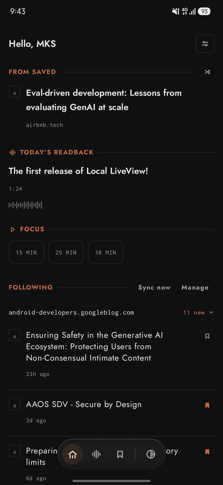
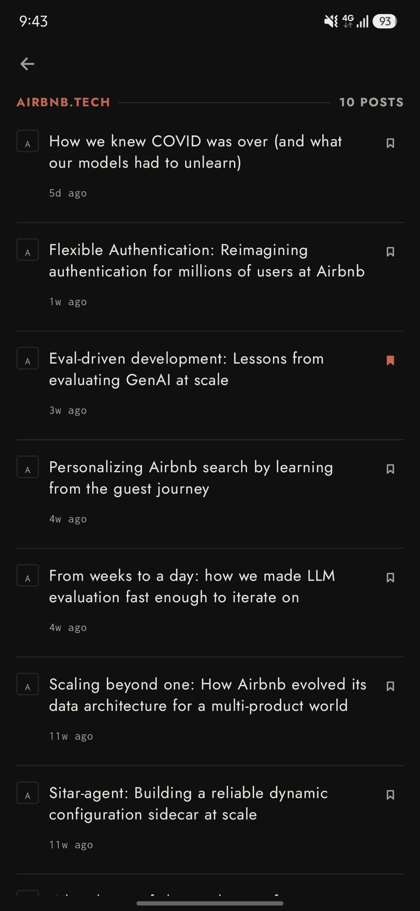
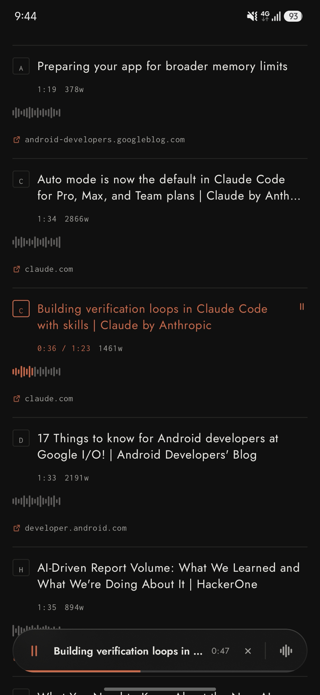
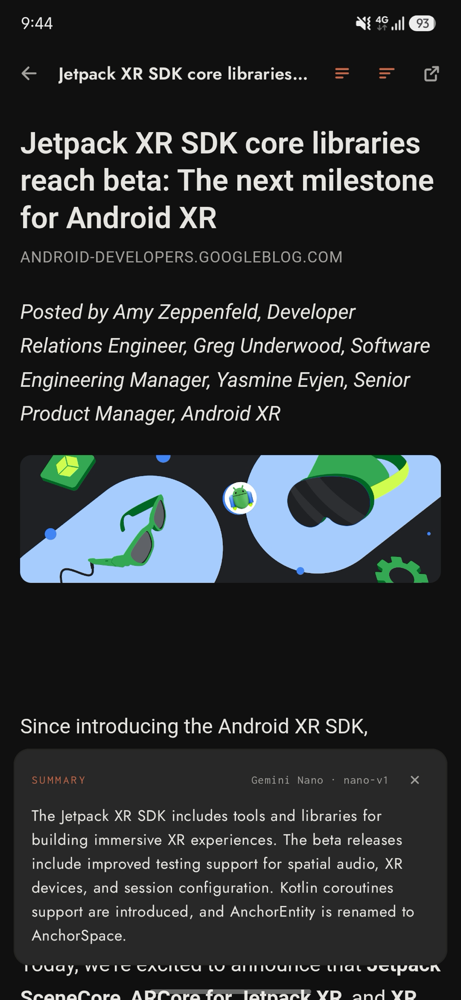

<p align="center">
  
</p>

<h1 align="center">DuskRead</h1>

<p align="center">
  <strong>A reading habit that survives the news cycle.</strong><br>
  Save the link, follow the blog, hear it read back on the walk — summarised<br>
  on-device by Gemini Nano, so everything you read stays yours.
</p>

<p align="center">
  
  
  
  
</p>

<p align="center"><sub>Monochrome by default. One accent, spent on purpose.</sub></p>

---

You find something good at eleven in the morning and you are not going to read it at eleven in the morning. So you share it here and forget it. It goes in with the blogs you follow, and by the evening the pile has sorted itself out: titles filled in, new posts pulled down, the whole lot waiting on one screen. Some of it you read. Some of it you hand to [readback](https://github.com/MKS-01/readback) and listen to on the walk, thumb on a transport bar that keeps playing once the screen is off. The long ones you ask about first, and Gemini Nano tells you what's in them without the article ever leaving the phone. Then you set the timer, put the phone face-down, and actually read for twenty-five minutes — on **Paper Black**, a page rather than a screen, warm-white ink on matte near-black lit by one terracotta accent, or on **Ink**, the same page with the hue drained out entirely, which is where it starts.

<p align="center">
  
  
  
  <br>
  <sub><strong>Ink</strong> — Home · Following · Readback mid-play · a summary written on the phone.</sub>
</p>

<details>
<summary align="center"><sub><strong>Paper Black</strong> — the same four screens with the accent lit</sub></summary>
<br>
<p align="center">
  
  
  
  
</p>
</details>

---

## Getting started

> **Android is the app; the other three are the workshop.** It's what this is built and tested against day to day. Desktop, web and iOS compile from the same source and are there to prove it travels — see [Platform support](#platform-support).

```bash
git clone https://github.com/MKS-01/duskread.git && cd duskread
./gradlew :androidApp:installDebug      # ~5 s once warm
```

That's the whole setup. Saved links, feeds, the timer and the themes all work the moment it opens.

| | |
|---|---|
| **JDK** | 17 or newer — the toolchain targets JVM 17 |
| **Android** | 8.0 Oreo and up (`minSdk` 26, compile/target 36) |
| **Gradle** | 9.3.1, via the wrapper — don't install it yourself |
| **For summaries** | A phone with **AICore** — Pixel 9+, Galaxy S24+ and similar. No emulator has it |
| **For iOS** | Xcode, plus [XcodeGen](https://github.com/yonaskolb/XcodeGen) — the host project is generated, not committed |

<details>
<summary><strong>The other three targets</strong></summary>

```bash
./gradlew :composeApp:runDistributable              # desktop — see the note below
./gradlew :composeApp:wasmJsBrowserDevelopmentRun   # web, on :8080

cd iosApp && xcodegen generate && cd ..             # iOS needs an Xcode host
open iosApp/iosApp.xcodeproj
```

`runDistributable`, not `run`, for desktop: the embedded browser is Chromium
through JCEF, and its native side needs the packaged `.app` layout. Under a
plain `run` it segfaults during `CefApp.initialize`. Everything else in the
app works either way.

A first Kotlin/Native build for iOS is ten minutes or more; incremental after
that.
</details>

---

## Saved links and feeds

**Save it however it reaches you.** Paste a URL into the field, or share one straight from Chrome — DuskRead is in the share sheet. Either way the row appears immediately with the host as its stand-in title, then a fetch fills in the real one behind it. A link that can't be fetched keeps a retry glyph rather than pretending it worked.

**Follow blogs by feed.** RSS and Atom, synced on open, cached so the list is instant. Posts land in Following on Home and read back exactly like a saved link does.

---

## Readback

**Generation happens elsewhere; this app just listens.** [readback](https://github.com/MKS-01/readback) runs on a Mac and turns articles into neural-TTS audio, writing a `library.db` and an `audio/` folder. You sync that folder to the phone yourself — its own script, run whenever you like.

Point DuskRead at it once, through the system folder picker in the Readback tab:

- **Pick the `readback-audio-db` root**, not `audio/` inside it. Choose wrong and you get a message saying so, rather than a permanently-empty list.
- **The grant persists.** Android's scoped storage means a folder is opened once and remembered; there's nothing to re-do after a reboot.
- **Strictly read-only.** DuskRead copies `library.db` into its cache to query it and never writes back — the sync direction is one-way by design.

Playback runs in a foreground service with a media notification, so it survives leaving the app, and the floating bar at the foot of Home turns into the transport when something's playing.

---

## On-device summaries

Summaries go through [ML Kit GenAI](https://developer.android.com/ai), which routes to **Gemini Nano** via AICore on supported hardware. The app asks for article summarisation only — one bullet or three, folded into a paragraph — and lets the system pick the register. There's no prompt to write and nothing to configure beyond how long a summary you want.

- **First run downloads the model.** AICore handles it; it takes a moment once and never again.
- **Two ways in** — swipe a row in Saved, or the toolbar control inside the reader.
- **Off Android it's simply absent.** The same UI compiles against a stub that reports itself unavailable, so the control just isn't drawn and nothing upstream has to care.

---

## Focus timer

A pomodoro that behaves like an alarm and not a widget: a real system notification and a vibration when the interval ends, so it works with the phone face-down and the app closed. It lives on Home beside the reading, because the point is to read for twenty-five minutes rather than to admire a timer.

---

## Platform support

**Android is the app; desktop, web and iOS are how the shared code and the
design system get exercised off a phone.** Everything runs everywhere, but
readback needs a filesystem and summaries need AICore, so both are Android
first and desktop second — `summariesSupported()` and `readbackSupported()`
are `expect`/`actual` constants, and a screen asks before it offers, so a
control that could only disappoint is never drawn.

---

## Tech stack

[Compose Multiplatform](https://www.jetbrains.com/compose-multiplatform/) 1.11
and Material 3 on Kotlin 2.3, one source set for all four targets — everything
but the leaf nodes is shared, and the platform seams are `expect`/`actual`
pairs: storage, audio, the summariser, the timer, the HTTP client. State is a
`HomeTab` enum and overlays in one `Box`, hoisted into `App.kt` over a flat
key/value store; no nav library, no ViewModel, no DI, no database.
[Ktor](https://ktor.io/) 3.1 does the network with a different engine per
target, [ML Kit GenAI](https://developer.android.com/ai) routes summaries to
Gemini Nano, [sqlite-jdbc](https://github.com/xerial/sqlite-jdbc) and SAF read
the readback library, [KCEF](https://github.com/DatL4g/KCEF) is the desktop
browser, and [Haze](https://github.com/chrisbanes/haze) is the blur behind the
floating bar. Built with AGP 9's `androidLibrary` KMP DSL on Gradle 9.3.1.

```bash
./gradlew ktlintCheck    # lint; several rules deliberately off, see .editorconfig
./gradlew ktlintFormat   # auto-fix
```

No tests yet.

---

## Design system

Two colour schemes, one layout, both dark. `DarkScheme` is **Paper Black**; `MonoScheme` is **Ink**, the same layout with hue drained to luminance alone. Paper Black's accent is an `AccentColor` — terracotta `#C6684A` or a dusty green `#4FA870`, built at the terracotta's own saturation and lightness so neither reads louder than the scheme was designed to carry. Ink ignores it, and the Settings swatches grey out while it's active. Ink is the default and persists.

The app swaps between them at runtime, which is why no screen hard-codes a colour — a literal survives the swap and immediately looks wrong.

Everything visual is specified in one browsable page:

```bash
open docs/design-system/design-system.html
```

Colour comes from `MaterialTheme.colorScheme` (`ui/theme/Theme.kt`), sizes that carry a decision from `ui/theme/Tokens.kt`, and icons from `ui/theme/DuskReadIcons.kt` — stroked to match the type weight, so a filled Material glyph mixed in is visible instantly.

---

## Licence

MIT — see [LICENSE](LICENSE).

<p align="center">
  <sub>Built agent-first with <a href="https://claude.ai/code">Claude Code</a></sub>
</p>
