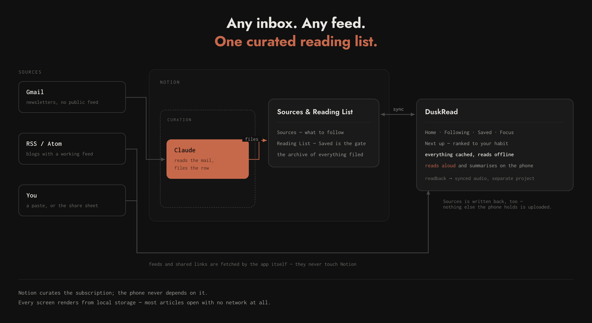

<p align="center">
  
</p>

<h1 align="center">DuskRead</h1>

<p align="center">
  <strong>A reading habit, automated around a Notion database.</strong><br>
  An AI agent files what lands in your inbox, feeds pull themselves, and<br>
  the phone only ever shows what you actually chose to keep.
</p>

<p align="center">
  
  
  
  
</p>

<p align="center"><sub>Monochrome by default. One accent, spent on purpose.</sub></p>

---

**Automated:** an AI agent catches newsletters in your inbox, and the blogs you follow add their own posts, without you lifting a finger. **Personalised:** what rises to the top is ranked by what you actually read, not by when it arrived. Then you put the phone face-down, set a timer for twenty-five minutes, and read: on **Paper Black**, warm-white ink on matte near-black lit by one terracotta accent, or on **Ink**, the same page with the colour drained out — the one it starts on.

---

## Getting started

> **Android is the app; the other three are the workshop.** It's what this is built and tested against day to day. Desktop, web and iOS compile from the same source and are there to prove it travels — see [Platform support](#platform-support).

```bash
git clone https://github.com/MKS-01/duskread.git && cd duskread
./gradlew :androidApp:installDebug      # ~5 s once warm
```

That's the whole setup. Saved links, feeds, the timer and the themes all work the moment it opens.

| | |
|---|---|
| **JDK** | 17 or newer — the toolchain targets JVM 17 |
| **Android** | 12 and up (`minSdk` 31, compile/target 36) |
| **Gradle** | 9.3.1, via the wrapper — don't install it yourself |
| **For summaries** | A phone with **AICore** — Pixel 9+, Galaxy S24+ and similar. No emulator has it |
| **For iOS** | Xcode, plus [XcodeGen](https://github.com/yonaskolb/XcodeGen) — the host project is generated, not committed |

<details>
<summary><strong>The other three targets</strong></summary>

```bash
./gradlew :composeApp:runDistributable              # desktop — see the note below
./gradlew :composeApp:wasmJsBrowserDevelopmentRun   # web, on :8080

cd iosApp && xcodegen generate && cd ..             # iOS needs an Xcode host
open iosApp/iosApp.xcodeproj
```

`runDistributable`, not `run`, for desktop: the embedded browser is Chromium
through JCEF, and its native side needs the packaged `.app` layout. Under a
plain `run` it segfaults during `CefApp.initialize`. Everything else in the
app works either way.

A first Kotlin/Native build for iOS is ten minutes or more; incremental after
that.
</details>

---

## What it does

### Curated automatically, through Notion

A **[Notion](https://www.notion.com/product/dev) database** is the single
place subscriptions and saves are curated, and **Claude** works through it
so you don't have to. Newsletters that arrive in Gmail with no public feed
are read and filed by Claude straight into the reading list; blogs with a
working feed are fetched by the app itself and never touch Notion. Either
way, the phone only pulls rows that were ticked `Saved`. Everything else
stays archived, not shown.

<p align="center">
  
</p>

Notion is the curation layer, not a dependency. The device works whether
or not it can reach it, and setup is one pasted token — the app finds or
creates its own databases rather than asking you to type in an ID. The full
schema, the sync rules and the reasoning behind each of them are in
**[docs/architecture.md](docs/architecture.md)**.

**Save it however it reaches you, too.** Share a link straight from Chrome — DuskRead is in the share sheet — or open the paste field on Saved with **Add**. Either way the row appears immediately with the host as its stand-in title, then a fetch fills in the real one behind it.

**Following a blog files it in Notion, too.** The one exception to the
one-way pull above: `Sources` is written as well as read, so a blog followed
on the phone is already there to edit the next time you open Notion.

### Reading, offline first

**Almost everything opens with no network at all.** Every screen renders from local storage, and the reader tries its own cache before the wire — a feed that publishes full-content RSS is cached whole at sync time, so the article was already on the phone before you tapped it. A post that will open offline carries its own badge on the meta line, computed the same way the reader itself decides, so it never claims something it can't deliver.

**Saved is a queue and a record at once.** Unread leads, and what you've read stays under its own heading rather than disappearing — filter to either, or search a title, a host or a topic. The paste field folds away behind **Add**, because most links arrive from the share sheet rather than the keyboard.

The page itself stays out of the way: **Paper Black** and **Ink**, warm ink on near-black or the same layout with the hue drained out, swapped at runtime, one terracotta accent spent only to mean *there is sound here*. No chrome, no feed of unread counts — one article at a time.

**Long ones get a one-tap summary first**, generated on-device by Gemini Nano so nothing leaves the phone; the control is simply absent on hardware that can't run it.

### Listening

**The phone reads an article aloud itself**, with its own text-to-speech —
nothing to sync, nothing to download first. The player is a face of the same
floating bar the tabs live on, so it follows you to whatever you open next,
including a screen that covers the tabs entirely. If a read can't happen —
no voice installed, no engine — it says so rather than staying silent.

### Focus timer

A pomodoro that behaves like an alarm and not a widget: a real system notification and a vibration when the interval ends, so it works with the phone face-down and the app closed. It lives on Home beside the reading, because the point is to read for twenty-five minutes rather than to admire a timer.

---

## How it's built

### Platform support

**Android is the app; desktop, web and iOS run the same code, mostly to
prove it travels.** Summaries need AICore, reading aloud needs a system
text-to-speech engine, and readback needs a filesystem — all three are
Android-first. `summariesSupported()`, `speechSupported()` and
`readbackSupported()` are `expect`/`actual` constants, and a screen just
doesn't show a control it can't offer.

### Tech stack

One `commonMain` source set for all four targets. Storage, audio, the
summariser, the timer and the HTTP client are `expect`/`actual` pairs.
State is a `HomeTab` enum and overlays in one `Box`, hoisted into `App.kt`
over a flat key/value store. No nav library, no ViewModel, no DI, no
database.

| Layer | What's used | For |
| --- | --- | --- |
| UI | [Compose Multiplatform](https://www.jetbrains.com/compose-multiplatform/) 1.11, Material 3, [Haze](https://github.com/chrisbanes/haze) | one shared UI across all four targets; Haze is the blur behind the floating bar |
| Language | [Kotlin](https://kotlinlang.org/) 2.3 | `expect`/`actual` platform seams instead of per-platform apps |
| Network | [Ktor](https://ktor.io/) 3.1 | RSS/Atom fetches, the Notion REST API — a different engine per target |
| Curation | [Notion](https://www.notion.com/product/dev) API, Claude via the Gmail + Notion MCP | subscriptions and the reading list live in Notion; Claude files newsletters into it |
| Summaries | [ML Kit GenAI](https://developer.android.com/ai) → Gemini Nano | on-device, Android only, absent elsewhere |
| Listening | Android `TextToSpeech` | reading aloud, on-device, Android only |
| Readback | [sqlite-jdbc](https://github.com/xerial/sqlite-jdbc) + SAF | read-only query of readback's `library.db`; hidden until switched on |
| Desktop shell | [KCEF](https://github.com/DatL4g/KCEF) | the embedded Chromium browser |
| Build | AGP 9's `androidLibrary` KMP DSL, Gradle 9.3.1 | |

```bash
./gradlew ktlintCheck    # lint; several rules deliberately off, see .editorconfig
./gradlew ktlintFormat   # auto-fix
```

No tests yet.

---

## Design system

Two schemes, one layout, both dark, **Paper Black** and **Ink** — see **[the design system](https://mks-01.github.io/duskread/)** for the full visual language and every token behind it.

---

## Architecture

How the pieces connect, the Notion schema, and the end-to-end flows — see **[docs/architecture.md](docs/architecture.md)**.

---

## Licence

MIT — see [LICENSE](LICENSE).

<p align="center">
  <sub>Built agent-first with <a href="https://claude.ai/code">Claude Code</a></sub><br>
  <sub>The synced-audio Readback tab is a separate, optional open-source project: <a href="https://github.com/MKS-01/readback">readback</a></sub>
</p>
