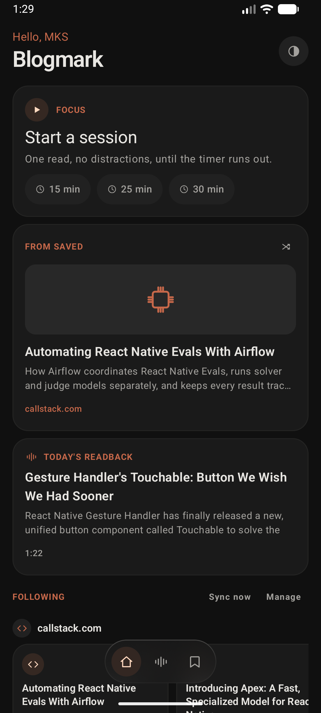
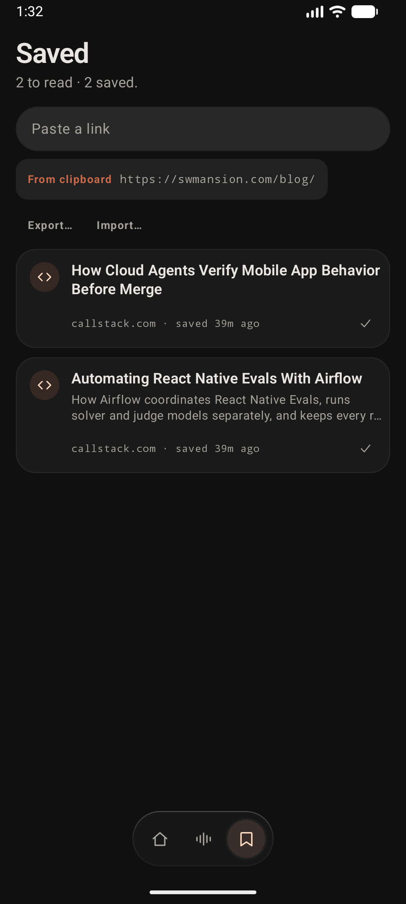
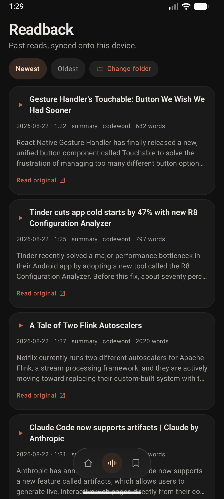

<h1 align="center">DuskRead</h1>

<p align="center">
  <strong>One reading list. One voice reading it back. One timer keeping you on it —
  on your phone, your desktop, or in a browser tab.</strong>
</p>

<p align="center">
  
  
  
  
</p>

<p align="center">
  
  
  
</p>

---

- **One codebase, every screen you actually reach for.** Android, iOS,
  desktop and web, all from a single Compose Multiplatform tree — built
  phone-first (everything sits in the lower third of the screen, one
  thumb), not phone-only.
- **Never lose a link again.** Paste one in or share it from a browser and
  it's usable instantly; the real title fills in a second later on its own.
- **Read with your ears, hands-free.** A synced
  [readback](https://github.com/MKS-01/readback) library plays right from
  the floating bar, so listening never means leaving what you're doing.
- **A timer that actually interrupts you.** Fifteen, twenty-five, thirty,
  or a length you type in yourself — and when it's done, it says so: a
  vibration and a real notification, not a number quietly hitting zero
  somewhere you weren't looking.
- **Colour when you want it, dusk when you don't.** One tap drains the
  whole app to greyscale for the reads that don't need the terracotta —
  and the launcher icon and splash follow, not just the screen.

Home is one screen on purpose: today's pick from Saved, today's Readback,
the timer, and what's new from the blogs you follow — nothing to dig for.

## Running it

```bash
./gradlew :androidApp:installDebug                  # Android
./gradlew :composeApp:run                           # Desktop
./gradlew :composeApp:wasmJsBrowserDevelopmentRun   # Web
```

iOS needs an Xcode host, generated rather than committed:

```bash
cd iosApp && xcodegen generate && cd ..
open iosApp/iosApp.xcodeproj
```

Requires JDK 17+.

## Stack

One Kotlin codebase, four targets — **Compose Multiplatform**. No
ViewModel, no DI, no database: state is hoisted into `App.kt`, saved links
and feeds live in a flat key/value store. Readback integration is
read-only — this app never writes to `library.db`, only reads what a
separate sync step puts on the device.

```bash
./gradlew ktlintCheck    # lint
./gradlew ktlintFormat   # auto-fix
```

No tests yet.
