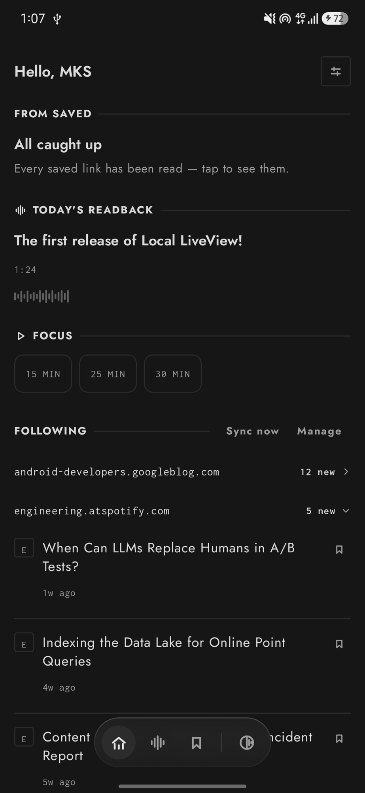
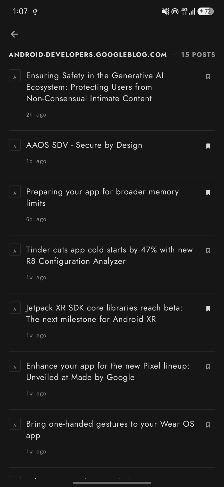
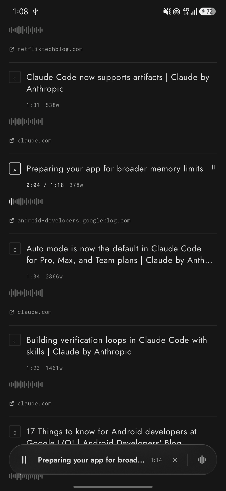
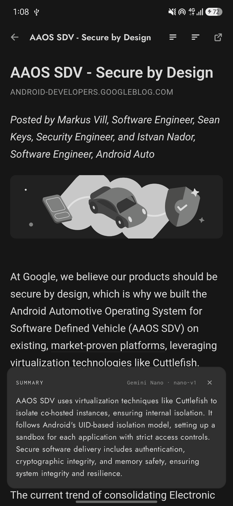

<p align="center">
  
</p>

<h1 align="center">DuskRead</h1>

<p align="center">
  <strong>Save what you want to read, and now summarised on-device, no cloud
  required. One codebase, your phone, your desktop, or a browser tab.</strong>
</p>

<p align="center">
  
  
  
  
  
  
</p>

<p align="center"><sub>Monochrome by default. One accent, spent on purpose.</sub></p>

---

## What it does

Paste a link in or share it from a browser and it's usable instantly, real
title included, or follow a blog by RSS or Atom, drawn in the same
hairline-square, one-accent language as everything else here. A synced
[readback](https://github.com/MKS-01/readback) library reads it all back to
you hands-free, with a real transport bar to show for it, and [Gemini Nano,
running on-device through Android AICore](https://developer.android.com/ai),
summarises an article without a round trip to a server — nothing about it
leaves the phone, Android only for now. A focus timer interrupts with a real
notification and a vibration, not a number quietly hitting zero, in an app
that opens in "Ink" — a near-black, colourless scheme — by default, until one
tap brings a single accent back, terracotta or a dusty green.

Home is one screen on purpose: today's pick from Saved, today's Readback,
the timer, and what's new from the blogs you follow — nothing to dig for.

<p align="center">
  
  
  
  
</p>

## On-device AI

Summaries run through [ML Kit GenAI](https://developer.android.com/ai),
which routes to **Gemini Nano** via AICore on supported hardware. The app
asks for article summarisation only — one bullet or three, folded into a
paragraph — and lets the system decide the register; there's no prompt to
write and nothing to configure beyond how long a summary you want.

This is Android-only today, because AICore is Android-only today. iOS,
desktop and web compile the same summary UI against a stub that reports
itself unavailable, so the rest of the app never has to know the difference
— the summary control just quietly isn't there.

## Running it

Android is phase one — the target this is built and tested against day to
day, so start there. iOS, desktop and web share the same Compose
Multiplatform codebase and build today, but they're parked until the
Android side is done, and on-device summaries won't show up on them at all
— AICore has no other host.

```bash
./gradlew :androidApp:installDebug                  # Android — start here
./gradlew :composeApp:run                           # Desktop
./gradlew :composeApp:wasmJsBrowserDevelopmentRun   # Web
```

iOS needs an Xcode host, generated rather than committed:

```bash
cd iosApp && xcodegen generate && cd ..
open iosApp/iosApp.xcodeproj
```

Requires JDK 17+.

## Stack

One Kotlin codebase, four targets — **Compose Multiplatform**. No
ViewModel, no DI, no database: state is hoisted into `App.kt`, saved links
and feeds live in a flat key/value store. Readback integration is
read-only — this app never writes to `library.db`, only reads what a
separate sync step puts on the device. On-device summaries are ML Kit
GenAI on Android; every other target sees the same UI wired to a no-op.

```bash
./gradlew ktlintCheck    # lint
./gradlew ktlintFormat   # auto-fix
```

No tests yet.
