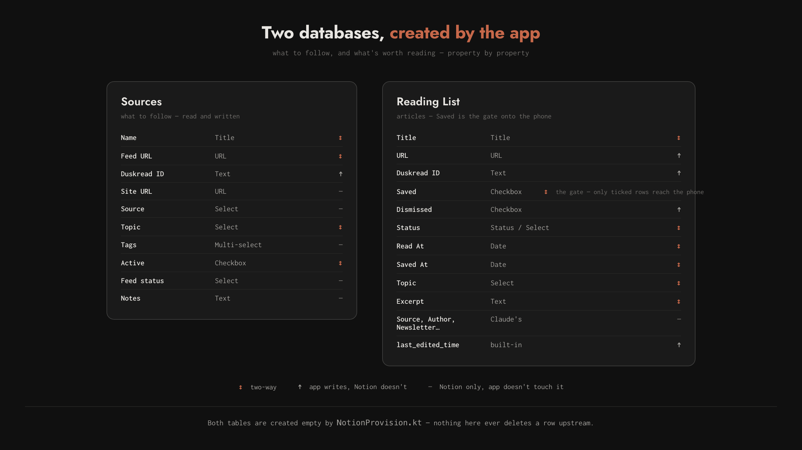
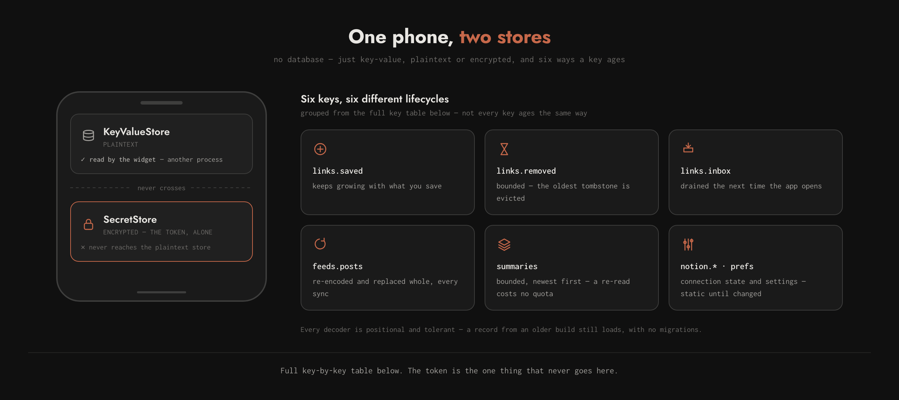

# DuskRead — architecture

How the app is put together, what it stores, and how the pieces reach each
other. `README.md` says what DuskRead is for; this says how it works.

Every section opens with the one-line version. Expand a `Details` block only
if you need the schema, the diagram, or the reasoning behind a number.

---

## Contents

- [The shape of it](#the-shape-of-it)
- [The two UIs](#the-two-uis)
- [Where data lives](#where-data-lives)
- [Notion schema](#notion-schema)
- [On-device storage](#on-device-storage)
- [When a sync happens](#when-a-sync-happens)
- [Same article, different address](#same-article-different-address)
- [Authentication](#authentication)
- [Offline](#offline)
- [Module map](#module-map)

---

## The shape of it

A Kotlin Multiplatform app — Android, iOS, desktop, Wasm from one
`commonMain` — that does four things: keeps saved links, follows blogs by RSS,
plays articles back as audio, and runs a focus timer. Notion curates what to
follow and what's worth reading; the device never depends on it being reachable.

Android, desktop and Wasm draw with Compose Multiplatform. iOS draws with
SwiftUI over the same Kotlin — see [The two UIs](#the-two-uis).

<p align="center">
  
</p>

Same picture as `README.md` — one copy, `docs/media/notion-flow.png`
(source and render command in `docs/media/notion-flow.html`), rather than a
second one drawn for this doc that would drift from the first.

What it shows, in words:

- **Following a blog** pulls `Sources` into `FeedLibrary`, additively, and
  writes back the same way — nothing here ever unfollows on a row deleted
  upstream.
- **Saving a link** is the only two-way path, and the only place the app
  writes to Notion. A row resolves per-row, newest wins, on `changedAt`
  against Notion's `last_edited_time`; a delete on the phone tombstones the
  Notion row (`Dismissed`) rather than erasing it.
- **A newsletter with no public feed** is filed by Claude straight into
  `Reading List` and reaches the phone the same way any other row does, once
  `Saved` is ticked.
- **A link gets in** one of four ways — the share sheet, the home-screen
  widget, the paste field, or a bookmark from Following — all landing in
  `LinkLibrary`.
- **`NEXT UP`** ranks everything unread by a weighted sum of bounded,
  explicable terms: freshness, source and topic affinity, staleness, fit
  against the focus timer, a shuffle, and two skip penalties. Weights live in
  one block at the top of `links/Recommender.kt`; **Settings ▸ Discovery**
  shows the pool and the top five with each term broken out.

<details>
<summary>The two rules the design follows from</summary>

Both Notion tables run in both directions now; readback is the one still
strictly one-way. The Readback tab — the browser over that synced
`library.db` — is **hidden by default**, because the sync script that fills
it is one person's. What replaces it for everyone else is `speech/`: the
phone reads the article itself.

1. **The app never destroys anything upstream.** Not a Notion row, not a
   readback record. It is a working set over archives it does not own. It
   does *create* rows in both tables — following a blog files it in
   `Sources`, the same way saving a link files it in `Reading List` — but
   nothing it does deletes or archives one.
2. **The device works offline.** Notion is where subscriptions are curated,
   not a dependency for reading. See [Offline](#offline).
</details>

---

## The two UIs

Compose for Android, desktop and Wasm; SwiftUI for iOS. Both draw from the
same Kotlin logic and the same design tokens, and neither owns a copy of a
colour, a radius or an icon.

<details>
<summary>What is shared, what is not, and the three things that made it possible</summary>

**Shared:** every library in `links/`, `notion/`, `pomodoro/`, `summary/` and
`data/`; the ranking; the parsers; the sync. Also the design *values* —
`ui/theme/DesignTokens.kt` carries the fifteen colour roles per scheme, the
layout and radius and stroke numbers and the four motion durations as plain
`Long`/`Double`/`Int`, and `ui/theme/IconPaths.kt` carries the twenty-two
glyphs as SVG path data. `Theme.kt`, `Tokens.kt` and `DuskReadIcons.kt` build
their Compose values from those rather than owning them; Swift builds its
`Color`, `CGFloat` and `Path` values from the same.

**Not shared:** composition. `ListRow`'s geometry, the floating bar's collapse
behaviour and every screen's layout exist twice, in two languages, with
nothing linking them. That is the standing cost of a native iOS UI and it is
paid deliberately — a change to how a row is *built* lands twice, while a
change to what colour it is lands once.

Three things had to change in `commonMain` before Swift could see any of it:

1. **`data/Observed.kt`.** Every state holder kept its state in Compose
   snapshot state, which from Swift is a plain getter with no change
   notification. `Observed` writes a snapshot *and* a `StateFlow` from one
   setter, so Compose recomposes exactly as before and everything else can
   subscribe. Both representations, one write — they cannot drift.
2. **`data/AppGraph.kt`.** The libraries were built by `@Composable
   rememberX()` factories, and Swift cannot enter a composition. The graph is
   a plain class holding one of each, reached through `LocalAppGraph` on the
   Compose side and directly on the Swift side. It also collapsed three
   `HttpClient` instances into one.
3. **`iosMain/bridge/`.** ktor and kotlinx-serialization are `implementation`
   dependencies that are not exported to the framework, so any signature
   mentioning `HttpClient` or `JsonObject` is uncallable from Swift. The
   bridge owns the graph and hands out only types Obj-C can carry — callbacks
   rather than `StateFlow`, since without SKIE a `StateFlow<T>` arrives
   generics-erased, default arguments do not export at all, and a sealed
   hierarchy loses its exhaustive `when`.

**What iOS does not have.** `Summariser`, `Reader` and `AudioPlayer` have no
iOS `actual` — they are `Unavailable*` stubs — so Settings' summary and swipe
sections are gated on `summariesSupported()` and do not render, and there is
no Readback tab. `Speaker` **is** implemented: `AVSpeechSynthesizer`, in
Kotlin/Native, so the shared `Flow<SpeechProgress>` contract is the same one
Android satisfies. The floating bar's transport face is what that lights up.

**Where a platform does something Kotlin cannot, it is written natively.**
Kotlin keeps the port — the interface and the types either side agree on — and
the platform supplies the adapter. Storage went to Swift because the Keychain
has no sensible Kotlin/Native shape and the decisions around it (suite name,
App Group, accessibility) are Apple's; speech stayed in Kotlin/Native because
`Flow<SpeechProgress>` is worth keeping and AVFoundation binds cleanly enough.
Which side an adapter lands on is judged per case; what does not move is the
contract.

**Motion does not become springs.** `Motion` is four `tween` durations on
Compose's default easing, and there is not one spring in the codebase. Swift
mirrors them as the same cubic at the same durations. Adopting SwiftUI's
spring idiom would be a change to the motion design rather than a port of it.
</details>

---

## Where data lives

| Plane | Holds | Written by | Read by |
| --- | --- | --- | --- |
| **Notion** | subscriptions, article archive, read state | you, Claude, the app | the app |
| **Notion (setup)** | the two databases themselves | the app, on first connect | — |
| **Device** | followed feeds, cached posts, saved links, signals | the app | the app |
| **readback** | `library.db` + `audio/`, synced onto the device by a separate script | the readback project | the app, **read-only** |

Feed *posts* are never uploaded anywhere. Only deliberately saved links reach
Notion.

---

## Notion schema

Two databases, `Sources` and `Reading List`. **The app finds or creates them
itself** — see `notion/NotionProvision.kt` — so there is nowhere to type a
database ID in. The one manual step that survives is sharing a page with the
token: Notion's API refuses to create a database at the workspace root, so a
credential that reaches nothing can build nothing.

<p align="center">
  
</p>

<details>
<summary>Both tables, property by property</summary>

### `Sources` — what to follow

**Read and written.** This reversed: the table used to be pulled only, on the
rule that Notion was upstream and the arrow never turned round. It turns
round because the table is now created empty rather than curated first — a
reader who follows four blogs and finds nothing in Notion has been handed a
feature that looks broken. Nothing here ever deletes a row, so unfollowing is
still local only.

| Property | Notes |
| --- | --- |
| `Name` | shown in Following instead of a hostname |
| `Feed URL` | a site URL also works — resolved via `<link rel=alternate>` |
| `Duskread ID` | the app's own `Feed.id`; the stable half of the match |
| `Site URL` | human destination, often not the feed |
| `Source` | RSS / Substack / Medium / Email / Manual |
| `Topic` | inherited by every post from this feed |
| `Active` | unticked rows are skipped; **a missing column means active** |
| `Feed status` | ok / no feed / unverified |

Type and direction (↕ / ↑ / —) for every property are in the diagram above;
`Tags` and `Notes` carry neither a direction worth calling out nor a note.

### `Reading List` — articles

| Property | Notes |
| --- | --- |
| `Title` | phone wins once it has fetched the real page |
| `URL` | create only — the fallback match key; rewriting it would orphan the row |
| `Duskread ID` | the app's own id for the link |
| `Saved` | **the gate — only ticked rows reach the phone** |
| `Dismissed` | "not interested" — never pulled, and nothing should re-file it |
| `Status` | read / unread; both the column type and option names are read from the schema — a `status` column via the API is unreliable, so `NotionProvision` falls back to `select` and everything downstream reads either |
| `Read At` | when, as opposed to whether |
| `Saved At` | when it was filed |
| `Topic` | set in Notion or from the phone |
| `Source`, `Author`, `Newsletter`, `Published At`, `Tags`, `Notes` | Claude's, untouched by the app |
| `last_edited_time` | read only; how conflicts are resolved |

Type and direction (↕ / ↑ / —) for every property are in the diagram above;
`Excerpt` carries neither a direction worth calling out nor a note.
</details>

---

## On-device storage

No database. `KeyValueStore` is a four-method interface over
`SharedPreferences` / a `.properties` file / `NSUserDefaults` / `localStorage`.
Every decoder is positional and tolerant — new fields are appended and read
with `getOrNull`, so a record written by an older build still loads, with no
migrations.

<p align="center">
  
</p>

<details>
<summary>Every key, and where the token actually lives</summary>

| Key | Holds |
| --- | --- |
| `links.saved` | saved links — id, url, title, description, savedAt, readAt, fetched, fetchFailed, changedAt, topic |
| `links.removed` | deleted addresses, so a pull cannot resurrect them (bounded, oldest evicted) |
| `links.inbox` | URLs captured by the widget, drained on next app open |
| `feeds.followed` | id, url, addedAt, title, topic |
| `feeds.posts` | cached posts — feedId, url, title, imageUrl, content, publishedAt, words, offline |
| `signals.hosts` | reads / opens / skips per host |
| `signals.topics` | reads per topic |
| `signals.skipped` | per-URL skips, bounded |
| `notion.database.sources`, `notion.database.reading`, `notion.page.parent`, `notion.page.home`, `notion.sync.last` | connection state |
| `summaries` | generated summaries, newest first, bounded — a second look at an article costs no AICore quota |
| `user.name`, `intro.seen`, `theme.mono`, `summary.length`, `readback.enabled`, `speech.voice`, `swipe.default` | preferences |

The Notion **token is not here.** It lives in a separate `SecretStore` —
`duskread_secrets` on Android, AES-GCM under a hardware-backed keystore key.
It must never reach the plain `KeyValueStore`, which is what the widget reads
from another process.

On iOS both stores are **written in Swift**. `KeyValueStore` and `SecretStore`
are ports; `iosApp/iosApp/Storage/` supplies the adapters — `UserDefaults` and
the Keychain — and hands them to the bridge at launch. That is what lets the
token live in the Keychain rather than in preferences, and it leaves the
decisions that are genuinely Apple's (the suite name, an App Group for a
future widget, Keychain accessibility) on that side of the line. Booleans go
in as their string form, because Kotlin's default `getBoolean` is written in
terms of `getString` and a native `Bool` would make the two disagree silently.

On desktop and Wasm `SecretStore` still delegates to `KeyValueStore` and says
so in its own KDoc: it is plaintext there. Neither has a Settings entry point
for a token, and a fallback that pretended otherwise would be worse than one
that admits it.

`notion.database.name` is not in the table above — nothing writes it any
more, from back when there was one database instead of two and its name was
cached for display. `NotionPrefs.clear()` still deletes it, so an install
that predates the current schema doesn't leave a stray key behind on
disconnect.
</details>

---

## When a sync happens

`runFullSync` runs on the Settings button and on launch if the last sync was
over four hours ago — but anything saved, read, retitled or deleted since
overrides the clock. Failures on an automatic sync are silent; the button
reports for itself. A full sync is ~75 seconds, almost all of it feed
fetches.

<details>
<summary>The trigger</summary>

```
 app opens
     │
     ├─ nothing configured?           do nothing, ever
     ├─ no token?                     do nothing
     ├─ last sync < 4h and nothing
     │  pending?                      do nothing
     └─ otherwise                     sync, in the background, silently
```
</details>

---

## Same article, different address

The same post can reach this app three ways — its blog's feed, a newsletter
carrying `?utm_source=`, a browser share with a trailing slash — and those
are the same article. `links/CanonicalUrl.kt` reduces an address to a
comparison key: scheme and `www.` dropped, fragment dropped, tracking
parameters dropped, the rest sorted.

<details>
<summary>The rules, and why a canonical form is never stored</summary>

```
go.dev/blog/generic-methods
  ← https://go.dev/blog/generic-methods/
  ← http://www.go.dev/blog/generic-methods#intro
  ← https://go.dev/blog/generic-methods?utm_source=substack
```

- **It is a comparison key, never a destination.** The address a link was
  saved with is what opens and what goes to Notion. Stripping a parameter to
  compare is safe; stripping it to navigate is a guess about someone else's
  server.
- **Tracking parameters are a blocklist, not an allowlist.** The meaningful
  ones are unknowable — `?p=` is a WordPress post, `?v=` a YouTube video —
  and a wrong guess silently merges two different articles. An extra
  duplicate is the cheaper mistake.
- **Never persisted.** It was, briefly, as the key of `links.removed`; adding
  one tracking parameter orphaned every tombstone from the row it was
  written for. A key whose algorithm is expected to change cannot be stored,
  so the raw address is kept and the key derived on demand.
</details>

---

## Authentication

A **personal access token**, pasted once — the only thing anyone types.
Notion offers OAuth, but its token exchange needs HTTP Basic auth over
`CLIENT_ID:CLIENT_SECRET` with no PKCE, which a phone-only app can't do
without shipping an extractable secret.

<details>
<summary>Why a PAT is the right answer here, not a compromise</summary>

Whoever clones DuskRead runs it against their own workspace, so they are
their own operator — exactly what a PAT is for. OAuth would mean routing
strangers' authorisation codes through a server the author pays for, or
asking every user to deploy their own. A PAT also acts as the user who
created it, so there's no per-database *Add connections* step to forget.

`NotionAuth` is an interface with `bearer()` and `disconnect()`, implemented
today by `PastedTokenAuth`.

**Rate limits.** Notion allows roughly three requests a second. Reads page
at 100; writes are spaced 350 ms; a 429 is retried up to three times
honouring `Retry-After`.
</details>

---

## Offline

Every screen renders from local storage. `loadArticle` tries the feed cache
before the wire, and only falls back to a request when the feed didn't
carry a real body (under 900 characters — a teaser is not an article).

<details>
<summary>What that covers, and the offline badge</summary>

```kotlin
loadArticle(...) = articleFromFeed(url, feedTitle, feedContent) ?: fetchArticle(client, url)
```

Every feed that publishes full-content RSS is cached completely, 15 posts
deep — a minority of feeds publish only a summary, so none of their posts
can be cached and all need a network.

A post that will open offline is marked `offline` on its meta line, computed
at sync time by **the same `articleFromFeed` the reader calls**, given the
same truncated body — anything cheaper would eventually disagree, and a
badge that lies is worse than no badge.

The cache re-encodes itself whole on every write, so `syncFeeds` gathers
every feed's posts and commits once via `replaceAll` rather than per feed,
which made a sync serialise the whole catalogue once per feed — a cost that
grew with the square of the feed count.

**When there is nothing cached and no signal**, the reader shows the app's
own empty state rather than letting the WebView render a `net::` error page.
</details>

---

## Module map

Two Gradle modules — `composeApp` (every platform) and `androidApp` (the
Android host) — plus `iosApp`, an Xcode project that's generated, not
committed. `composeApp` splits into `commonMain` and four platform source
sets meeting it through `expect`/`actual`; `commonMain` is organised by
feature — `data/`, `links/`, `notion/`, `pomodoro/`, `reader/`, `speech/`,
`summary/`, `ui/` — each named for the concern in
[The shape of it](#the-shape-of-it).

`iosApp` is no longer a thin host around a Compose view controller: it is the
iOS UI. `Design/` builds Swift values from the shared tokens, `Bridge/` wraps
the Kotlin bridge in observable stores, `Components/` and `Screens/` are the
UI, and `Shell/` is the floating bar and the router. See
[The two UIs](#the-two-uis).

<details>
<summary>What's platform-only, with no commonMain counterpart</summary>

Android carries three foreground services (Pomodoro, Speech, Reader
playback) and the home-screen widget; desktop carries the Chromium
WebView host for the in-app browser. Everything else behind `expect` has an
`actual` on all four platforms.

State is plain snapshot state, now behind `Observed` so it is a `StateFlow`
as well, hoisted into `App.kt` over an `AppGraph`. Still no ViewModel, no
dependency injection framework and no navigation library — `AppGraph` is a
class with constructors in it, not a container — because at this size they
would be ceremony, and their absence is deliberate rather than pending.
</details>

## Where to look next

- `README.md` — what the app is and how to build it
- https://duskread.mksbrew.dev — the visual language and every colour, type
  style and value behind it
